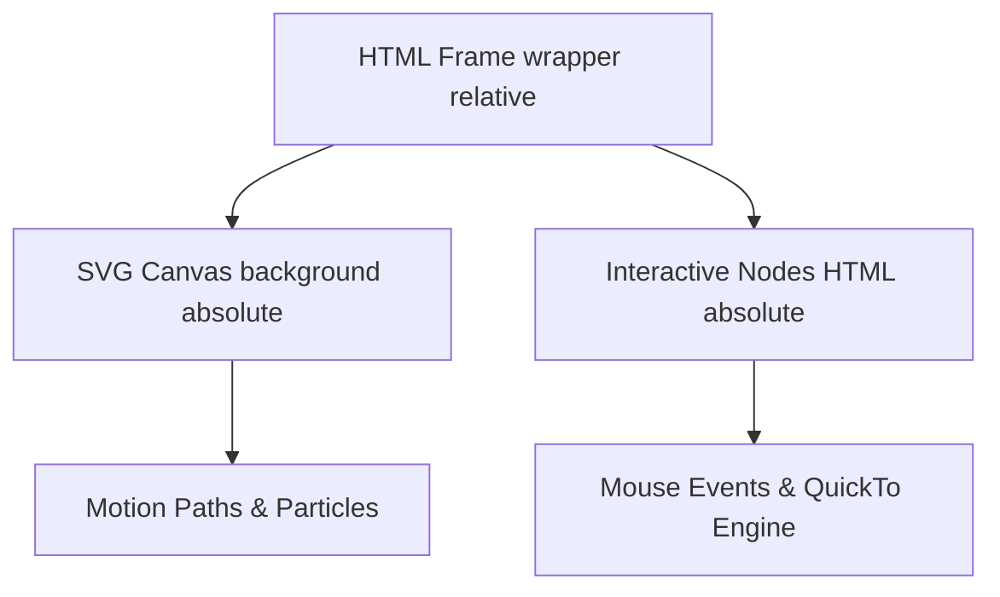

# PROJECT SPECIFICATION & ARCHITECTURAL BLUEPRINT
## Portfolio V3: Phạm Quốc Hưng (Data Analyst & Analytics Engineer)

---

## 1. SYSTEM OVERVIEW & STRATEGIC MISSION

### 1.1 Target Persona
* **Subject:** Phạm Quốc Hưng
* **Background:** Business English Student at Foreign Trade University (FTU) Hanoi turned Data Analyst / Analytics Engineer.
* **Core Expertise:** Web scraping (Playwright, requests), data processing & pipeline engineering (Python, pandas, SQL), analytics engineering (Jupyter, Git, dbt).

### 1.2 Design Philosophy
Inspired by high-end design-agency indexers like **handhold.io**:
* **Minimalist Editorial Style:** Editorial layout formatting with high contrast, extensive whitespace breathing room, and sharp structural margins.
* **High-Density Micro-Typography:** Large, elegant display headers contrasted against compact, highly structured metadata labels and statistics tables.
* **Strict Structural Layout Constraints:** Zero pre-packaged CSS layouts, custom grids and flexboxes, clean borders, and container limits.
* **Contextual Aesthetic Elements:** Custom SVG canvas rendering, smooth WebGL noise shaders, and interactive data telemetry components.

### 1.3 Dependency Scope
To guarantee sub-second load times and flawless 120 FPS performance, the project enforces a **strict zero-dependency policy** on external UI packages or animation suites:
* **Core Framework:** Astro (v6.4+)
* **Styling Engine:** Tailwind CSS (v4.0+)
* **Animation Core:** GSAP (GreenSock Animation Platform) + `MotionPathPlugin` + `ScrollTrigger` (loaded via CDN/inline imports to ensure zero SSR bundler leakage)

---

## 2. SYSTEM CONFIGURATION & ROUTING LAYER

### 2.1 Native i18n Routing (`astro.config.mjs`)
The routing layer is designed using Astro's native internationalization properties to provide clean, prefix-based URL structures for English (`/en/`) and Vietnamese (`/vi/`) locales.

```javascript
// @ts-check
import { defineConfig } from 'astro/config';
import tailwindcss from '@tailwindcss/vite';

// https://astro.build/config
export default defineConfig({
  i18n: {
    defaultLocale: 'en',
    locales: ['en', 'vi'],
    routing: {
      prefixDefaultLocale: true,
      redirectToDefaultLocale: true
    }
  },
  vite: {
    plugins: [tailwindcss()]
  }
});
```

### 2.2 Global Design System (`src/styles/globals.css`)
Core CSS properties, typographic hierarchy variables, container systems, and layout classes.

```css
@import "tailwindcss";

/* ===== CSS RESET & CUSTOM PROPERTIES ===== */
*,
*::before,
*::after {
  margin: 0;
  padding: 0;
  box-sizing: border-box;
}

:root {
  --bg: #FFFFFF;
  --text: #111111;
  --text-muted: #6B6B6B;
  --border: #E5E5E5;
  --surface: #F7F7F5;

  /* Project Accent Colors */
  --accent-hanoi: #003580;   /* Booking.com Blue */
  --accent-tiktok: #EE1D52;  /* TikTok Red */
  --accent-ejoy: #079AED;    /* eJOY Cyan */
}

body {
  font-family: 'Inter', sans-serif;
  font-size: 16px;
  font-weight: 400;
  line-height: 1.6;
  color: var(--text);
  background-color: var(--bg);
  -webkit-font-smoothing: antialiased;
}

/* ===== TYPOGRAPHY ===== */
h1, h2, h3 {
  font-family: 'Instrument Serif', serif;
  font-weight: 400;
}

h1 {
  font-size: clamp(48px, 6vw, 80px);
  line-height: 1.1;
}

h2 {
  font-size: clamp(32px, 4vw, 56px);
  line-height: 1.15;
}

.text-muted {
  font-size: 14px;
  font-weight: 400;
  color: var(--text-muted);
}

/* ===== CONTAINER SYSTEM ===== */
.container {
  max-width: 1200px;
  padding: 0 48px;
  margin: 0 auto;
}

.section {
  padding: 120px 0;
}

.pill {
  display: inline-block;
  border: 1px solid var(--border);
  border-radius: 999px;
  padding: 6px 14px;
  font-size: 12px;
  font-weight: 500;
  color: var(--text-muted);
  text-transform: uppercase;
  letter-spacing: 0.08em;
  font-family: 'Inter', sans-serif;
}

.btn {
  display: inline-block;
  background: var(--text);
  color: white;
  border-radius: 999px;
  padding: 12px 24px;
  font-size: 14px;
  font-weight: 500;
  transition: opacity 0.2s;
  font-family: 'Inter', sans-serif;
}

.btn:hover {
  opacity: 0.75;
}

/* ===== MESH RADIAL BACKGROUNDS ===== */
.blob-container {
  border-radius: 24px;
  overflow: hidden;
  aspect-ratio: 4/3;
  position: relative;
}

.blob-hanoi {
  background:
    radial-gradient(ellipse at 25% 35%, #003580 0%, transparent 55%),
    radial-gradient(ellipse at 75% 65%, #0057B8 0%, transparent 50%),
    radial-gradient(ellipse at 50% 90%, #C8D8FF 0%, transparent 60%);
  background-color: #EEF3FF;
}

.blob-tiktok {
  background:
    radial-gradient(ellipse at 30% 40%, #EE1D52 0%, transparent 55%),
    radial-gradient(ellipse at 70% 60%, #FF6B8A 0%, transparent 50%),
    radial-gradient(ellipse at 50% 85%, #FFE0E6 0%, transparent 60%);
  background-color: #FFF0F3;
}

.blob-ejoy {
  background:
    radial-gradient(ellipse at 30% 40%, #079AED 0%, transparent 55%),
    radial-gradient(ellipse at 70% 60%, #38BDF8 0%, transparent 50%),
    radial-gradient(ellipse at 50% 85%, #E0F4FF 0%, transparent 60%);
  background-color: #F0F9FF;
}
```

---

## 3. MASTER FILE STRUCTURE & LOCALIZATION PATTERNS

### 3.1 Localized Directory Tree
The project structure segregates components, styles, configurations, and localization tables:

```text
portfolio_v3/
├── astro.config.mjs
├── package.json
├── tsconfig.json
├── public/
│   └── favicon.svg
└── src/
    ├── components/
    │   ├── Footer.astro
    │   ├── Header.astro
    │   ├── HeroRibbon.astro
    │   ├── LanguageSwitch.astro
    │   ├── ProjectSplit.astro
    │   └── ejoy/
    │       ├── BehaviorDashboard.astro
    │       ├── ContextDiagram.astro
    │       ├── GoldilocksMatrix.astro
    │       └── WireframeBlueprint.astro
    ├── i18n/
    │   ├── content.ts
    │   └── utils.ts
    ├── layouts/
    │   └── BaseLayout.astro
    ├── pages/
    │   ├── index.astro         <-- Dynamic router redirecting to default locale
    │   ├── en/
    │   │   ├── index.astro     <-- English Main Page
    │   │   └── projects/
    │   │       ├── ejoy.astro
    │   │       └── hanoi-hotels.astro
    │   └── vi/
    │       ├── index.astro     <-- Vietnamese Main Page
    │       └── projects/
    │           ├── ejoy.astro
    │           └── hanoi-hotels.astro
    └── styles/
        └── globals.css
```

### 3.2 Typed Localization Engine

To guarantee clean, hardcode-free Astro components, translation strings are housed within a centralized UI mapping file (`src/i18n/content.ts`) and parsed dynamically via request parsing helpers (`src/i18n/utils.ts`).

#### 3.2.1 UI Content Mapping Dictionary (`src/i18n/content.ts`)
```typescript
export const languages = {
  en: 'English',
  vi: 'Tiếng Việt',
};

export const defaultLang = 'en';

export const ui = {
  en: {
    // Navigation
    'nav.projects': 'Projects',
    'nav.about': 'About',
    'nav.contact': 'Contact',
    
    // Hero
    'hero.pill': 'Available for internship · 2025',
    'hero.title': 'Phạm Quốc Hưng',
    'hero.subtitle': 'Business English student at FTU Hanoi, turned data analyst. I build scrapers, clean messy datasets, and turn raw numbers into decisions that make sense.',
    'hero.cta': 'View projects →',
    
    // Section Headers
    'section.projects.pill': 'Selected work',
    'section.projects.title': 'Projects',
    'section.about.title': 'About',
    'section.contact.title': 'Get in touch',
    'section.contact.subtitle': 'Open to internship opportunities · Available mornings',
    
    // About Section
    'about.bio.1': 'Third-year Business English student at FTU Hanoi. Self-taught in Python and SQL, with a focus on the engineering side of data — building scrapers, cleaning datasets, and making analysis reproducible.',
    'about.bio.2': "I'm drawn to analytics engineering: the work that happens before the dashboard, where clean pipelines make good decisions possible.",
    'about.bio.3': 'Looking for a Data Analyst or Analytics Engineer internship where I can contribute from day one.',
    'about.skills.languages': 'Languages',
    'about.skills.languages.val': 'Python · SQL',
    'about.skills.libraries': 'Libraries',
    'about.skills.libraries.val': 'pandas · requests · Playwright',
    'about.skills.tools': 'Tools',
    'about.skills.tools.val': 'Jupyter · Git · dbt (learning)',
    'about.skills.currently': 'Currently',
    'about.skills.currently.val': 'Portfolio · Booking.com market analysis',
    
    // Contact & Footer
    'contact.email': 'phamquochung@gmail.com',
    'contact.github': 'GitHub',
    'contact.linkedin': 'LinkedIn',
    'footer.text': '© 2025 Phạm Quốc Hưng · FTU Hanoi',

    // Hanoi Hotels project strings
    'project.hanoi.pill': 'Personal Project · 2024',
    'project.hanoi.heading': 'Hanoi hotel market: what guests actually value',
    'project.hanoi.feat1': '2,044 listings scraped from Booking.com',
    'project.hanoi.feat2': '7 experience dimensions analyzed via gap scoring',
    'project.hanoi.feat3': 'Facilities identified as weakest relative strength',
    'project.hanoi.link1': 'Read case study →',
    'project.hanoi.link2': 'GitHub →',
    
    // TikTok project strings
    'project.tiktok.pill': 'Team Project · FTU Hanoi · 2024',
    'project.tiktok.heading': 'IMC campaign strategy for TikTok Vietnam',
    'project.tiktok.feat1': 'Market entry analysis targeting Gen Z segment',
    'project.tiktok.feat2': '360° campaign spanning 4 touchpoints',
    'project.tiktok.feat3': 'Presented as academic capstone, International Marketing course',
    'project.tiktok.link1': 'View presentation →',
    
    // eJoy project strings
    'project.ejoy.pill': 'Collaboration · eJoy English · 2024',
    'project.ejoy.heading': 'User insight research for eJoy learning app',
    'project.ejoy.feat1': 'Survey design and quantitative data collection',
    'project.ejoy.feat2': 'User behavior and retention pattern analysis',
    'project.ejoy.feat3': 'Delivered recommendations directly to product team',
    'project.ejoy.link1': 'View report →',

    // Hanoi Page general UI
    'hanoi.back': '← All projects',
    'hanoi.next': 'Next → TikTok IMC campaign',

    // eJoy Page general UI
    'ejoy.back': '← All projects',
    'ejoy.pill1': 'Marketing Research',
    'ejoy.pill2': 'UX Research',
    'ejoy.pill3': 'Focus Group',
    'ejoy.pill4': 'Ethnography',
    'ejoy.github': 'GitHub →',
    'ejoy.next': 'Next → TikTok IMC campaign'
  },
  vi: {
    // Navigation
    'nav.projects': 'Dự án',
    'nav.about': 'Giới thiệu',
    'nav.contact': 'Liên hệ',
    
    // Hero
    'hero.pill': 'Đang tìm kiếm thực tập · 2025',
    'hero.title': 'Phạm Quốc Hưng',
    'hero.subtitle': 'Sinh viên Tiếng Anh Thương mại tại ĐH Ngoại Thương, chuyển hướng phân tích dữ liệu. Mình viết script thu thập dữ liệu, làm sạch dữ liệu và biến những con số thô thành các quyết định hợp lý.',
    'hero.cta': 'Xem dự án →',
    
    // Section Headers
    'section.projects.pill': 'Dự án tiêu biểu',
    'section.projects.title': 'Dự án',
    'section.about.title': 'Giới thiệu',
    'section.contact.title': 'Liên hệ',
    'section.contact.subtitle': 'Sẵn sàng đón nhận cơ hội thực tập · Trống lịch buổi sáng',
    
    // About Section
    'about.bio.1': 'Sinh viên năm ba chuyên ngành Tiếng Anh Thương mại tại ĐH Ngoại Thương Hà Nội. Tự học Python và SQL, tập trung vào mảng kỹ thuật của dữ liệu — cào dữ liệu, làm sạch và đảm bảo tính tái lập của phân tích.',
    'about.bio.2': 'Mình đặc biệt hứng thú với Analytics Engineering: những công việc diễn ra trước khi dữ liệu lên dashboard, nơi các luồng dữ liệu sạch sẽ tạo nên quyết định đúng đắn.',
    'about.bio.3': 'Đang tìm kiếm vị trí thực tập Data Analyst hoặc Analytics Engineer để có thể đóng góp ngay từ ngày đầu tiên.',
    'about.skills.languages': 'Ngôn ngữ',
    'about.skills.languages.val': 'Python · SQL',
    'about.skills.libraries': 'Thư viện',
    'about.skills.libraries.val': 'pandas · requests · Playwright',
    'about.skills.tools': 'Công cụ',
    'about.skills.tools.val': 'Jupyter · Git · dbt (đang học)',
    'about.skills.currently': 'Hiện tại',
    'about.skills.currently.val': 'Portfolio · Phân tích thị trường Booking.com',
    
    // Contact & Footer
    'contact.email': 'phamquochung@gmail.com',
    'contact.github': 'GitHub',
    'contact.linkedin': 'LinkedIn',
    'footer.text': '© 2025 Phạm Quốc Hưng · ĐH Ngoại Thương Hà Nội',

    // Hanoi Hotels project strings
    'project.hanoi.pill': 'Dự án cá nhân · 2024',
    'project.hanoi.heading': 'Thị trường khách sạn Hà Nội: Khách hàng thực sự quan tâm điều gì',
    'project.hanoi.feat1': 'Cào 2.044 danh sách từ Booking.com',
    'project.hanoi.feat2': 'Phân tích 7 khía cạnh trải nghiệm qua gap scoring',
    'project.hanoi.feat3': 'Xác định Cơ sở vật chất là điểm yếu tương đối',
    'project.hanoi.link1': 'Đọc case study →',
    'project.hanoi.link2': 'GitHub →',
    
    // TikTok project strings
    'project.tiktok.pill': 'Dự án nhóm · ĐH Ngoại Thương · 2024',
    'project.tiktok.heading': 'Chiến lược chiến dịch IMC cho TikTok Việt Nam',
    'project.tiktok.feat1': 'Phân tích thâm nhập thị trường nhắm đến Gen Z',
    'project.tiktok.feat2': 'Chiến dịch 360° với 4 điểm chạm',
    'project.tiktok.feat3': 'Thuyết trình đồ án môn Marketing Quốc tế',
    'project.tiktok.link1': 'Xem bài thuyết trình →',
    
    // eJoy project strings
    'project.ejoy.pill': 'Hợp tác · eJoy English · 2024',
    'project.ejoy.heading': 'Nghiên cứu insight người dùng cho ứng dụng eJoy',
    'project.ejoy.feat1': 'Thiết kế khảo sát và thu thập dữ liệu định lượng',
    'project.ejoy.feat2': 'Phân tích hành vi và xu hướng giữ chân người dùng',
    'project.ejoy.feat3': 'Đưa ra khuyến nghị trực tiếp cho đội ngũ sản phẩm',
    'project.ejoy.link1': 'Xem báo cáo →',

    // Hanoi Page general UI
    'hanoi.back': '← Tất cả dự án',
    'hanoi.next': 'Tiếp theo → Chiến dịch IMC TikTok',

    // eJoy Page general UI
    'ejoy.back': '← Tất cả dự án',
    'ejoy.pill1': 'Nghiên cứu Marketing',
    'ejoy.pill2': 'Nghiên cứu UX',
    'ejoy.pill3': 'Phỏng vấn nhóm',
    'ejoy.pill4': 'Dân tộc học',
    'ejoy.github': 'GitHub →',
    'ejoy.next': 'Tiếp theo → Chiến dịch IMC TikTok'
  }
} as const;
```

#### 3.2.2 Routing & Parsing Utilities (`src/i18n/utils.ts`)
```typescript
import { ui, defaultLang } from './content';

export function getLangFromUrl(url: URL) {
  const [, lang] = url.pathname.split('/');
  if (lang in ui) return lang as keyof typeof ui;
  return defaultLang;
}

export function useTranslations(lang: keyof typeof ui) {
  return function t(key: keyof typeof ui[typeof defaultLang]) {
    return ui[lang][key] || ui[defaultLang][key];
  }
}
```

---

## 4. COMPONENT ARCHITECTURE BLUEPRINTS

### 4.1 Structural Layout Components

#### 4.1.1 Header Component (`src/components/Header.astro`)
Sticky, 64px tall header featuring dynamic language switching based on route parameters.

```astro
---
import LanguageSwitch from "./LanguageSwitch.astro";
import { getLangFromUrl, useTranslations } from "../i18n/utils";

const lang = getLangFromUrl(Astro.url);
const t = useTranslations(lang);
---

<header class="header">
  <div class="header-inner container">
    <a href={`/${lang}/`} class="logo">My Portfolio</a>
    <nav class="nav">
      <a href={`/${lang}/#projects`} class="nav-link">{t("nav.projects")}</a>
      <a href={`/${lang}/#about`} class="nav-link">{t("nav.about")}</a>
      <a href={`/${lang}/#contact`} class="nav-link">{t("nav.contact")}</a>
      <LanguageSwitch />
    </nav>
  </div>
</header>

<style>
  .header {
    position: sticky;
    top: 0;
    z-index: 50;
    background: white;
    border-bottom: 1px solid var(--border);
  }

  .header-inner {
    display: flex;
    align-items: center;
    justify-content: space-between;
    height: 64px;
  }

  .logo {
    font-family: "Instrument Serif", serif;
    font-size: 18px;
    color: var(--text);
    text-decoration: none;
  }

  .nav {
    display: flex;
    gap: 32px;
    align-items: center;
  }

  .nav-link {
    font-family: "Inter", sans-serif;
    font-size: 14px;
    color: var(--text-muted);
    text-decoration: none;
    transition: color 0.2s;
  }

  .nav-link:hover {
    color: var(--text);
  }

  @media (max-width: 768px) {
    .nav {
      display: none;
    }
  }
</style>
```

#### 4.1.2 Footer Component (`src/components/Footer.astro`)
```astro
---
import { getLangFromUrl, useTranslations } from '../i18n/utils';

const lang = getLangFromUrl(Astro.url);
const t = useTranslations(lang);
---

<footer class="footer">
  <div class="container">
    <p class="footer-text">{t('footer.text')}</p>
  </div>
</footer>

<style>
  .footer {
    padding: 48px 0;
    border-top: 1px solid var(--border);
    text-align: center;
  }

  .footer-text {
    font-size: 13px;
    color: var(--text-muted);
    font-family: 'Inter', sans-serif;
  }
</style>
```

#### 4.1.3 Language Toggler (`src/components/LanguageSwitch.astro`)
Safely reads active router states, transforms language prefixes, preserves search parameters, and updates views.

```astro
---
import { getRelativeLocaleUrl } from 'astro:i18n';
import { getLangFromUrl } from '../i18n/utils';

const currentLang = getLangFromUrl(Astro.url);
const targetLang = currentLang === 'en' ? 'vi' : 'en';

const pathname = Astro.url.pathname;
const pathWithoutLocale = pathname.replace(new RegExp(`^/${currentLang}`), '') || '/';
const targetUrl = getRelativeLocaleUrl(targetLang, pathWithoutLocale);

const searchParams = Astro.url.search;
const finalUrl = `${targetUrl}${searchParams}`;
---

<a href={finalUrl} class="lang-switch" aria-label={`Switch language to ${targetLang.toUpperCase()}`}>
  {targetLang.toUpperCase()}
</a>

<style>
  .lang-switch {
    font-family: 'Inter', sans-serif;
    font-size: 13px;
    font-weight: 500;
    color: var(--text-muted);
    text-decoration: none;
    border: 1px solid var(--border);
    padding: 4px 8px;
    border-radius: 4px;
    transition: all 0.2s ease;
  }
  
  .lang-switch:hover {
    color: var(--text);
    border-color: var(--text-muted);
  }
</style>
```

### 4.2 ProjectSplit.astro Engine
A parametric component interface designed to represent selected works in a clean split layout (switching sides via `reverse` prop) and triggering interactive dashboard overlays when `isInteractive` is flagged.

#### 4.2.1 TypeScript Interface Structure
```typescript
interface Props {
  pill: string;
  heading: string;
  features: string[];
  links: { label: string; href: string; external?: boolean }[];
  blobClass: string;
  reverse?: boolean;
  isInteractive?: boolean;
  projectId?: string;
  defaultActiveIndex?: number;
}
```

#### 4.2.2 Template Structure
```html
<div class="split {reverse ? 'reverse' : ''}">
  <div class="split-text">
    <span class="pill">{pill}</span>
    <h2 class="split-heading">{heading}</h2>
    <ul class="feature-list">
      <!-- Maps feature elements. If interactive, adds event listeners and custom icons -->
    </ul>
    <div class="split-links">
      <!-- Renders redirect links -->
    </div>
  </div>
  <div class="split-blob">
    <div class="blob-wrapper">
      <div class="blob-container {blobClass}"></div>
      <canvas class="blob-shader-canvas"></canvas>
      <!-- Conditional inclusion of dashboard overlays (Hanoi Hotels/eJOY matrices) -->
    </div>
  </div>
</div>
```

### 4.3 Global Markdown Prose Styling (`.prose`)
All case studies are styled using strict typography guidelines declared globally, preventing layouts from decaying when loading content from Astro engines:

```css
.prose h2 {
  font-family: 'Instrument Serif', serif;
  font-size: 28px;
  font-weight: 400;
  margin: 48px 0 16px;
}

.prose p {
  font-size: 17px;
  line-height: 1.75;
  margin-bottom: 24px;
}

.prose pre {
  background: var(--surface);
  border-radius: 8px;
  padding: 24px;
  overflow-x: auto;
  font-size: 14px;
  margin-bottom: 24px;
}

.prose code {
  font-size: 14px;
  font-family: 'SF Mono', 'Fira Code', 'Fira Mono', monospace;
}

.prose p code {
  background: var(--surface);
  padding: 2px 6px;
  border-radius: 4px;
}

.prose table {
  width: 100%;
  border-collapse: collapse;
  margin: 32px 0;
}

.prose th {
  text-align: left;
  font-size: 13px;
  font-weight: 600;
  padding: 12px;
  border-bottom: 2px solid var(--border);
  font-family: 'Inter', sans-serif;
}

.prose td {
  font-size: 14px;
  padding: 12px;
  border-bottom: 1px solid var(--border);
}

.prose ul {
  list-style: disc;
  padding-left: 24px;
  margin-bottom: 24px;
}

.prose li {
  font-size: 17px;
  line-height: 1.75;
  margin-bottom: 8px;
}
```

---

## 5. PAGE BLUEPRINTS & HARDCODED DATA SETS

### 5.1 Landing Page Template (`index.astro`)
The landing layout functions as a strict section-by-section presentation index:
1. **Hero Section:** Integrates `HeroRibbon.astro` containing the 3D Three.js fluid canvas. Renders Title, Subtitle, and CTA elements.
2. **Project Matrix:** Renders alternating `ProjectSplit.astro` widgets:
   * **Project 1 (Hanoi Hotels):** Text Left, Blob Right. (`isInteractive: true`)
   * **Project 2 (TikTok IMC):** Blob Left, Text Right. (`reverse: true`)
   * **Project 3 (eJOY English):** Text Left, Blob Right. (`isInteractive: true`, starts with active index `1`)
3. **About Section:** Two-column split containing the developer biography on the left and a structured skill/tool metrics panel on the right.
4. **Contact Terminal:** Clean typography block displaying direct email links, GitHub links, and LinkedIn routes.

### 5.2 Project Detail 1: Hanoi Hotels Market Analysis

#### 5.2.1 Analytical Parameters
* **Research Question:** In the Hanoi accommodation market, which experience dimension is the weakest relative strength — meaning it outperforms guest expectations the least?
* **Dataset:** 2,044 unique hotel and homestay listings compiled from Booking.com.
* **Methodology:** Calculating the relative gap score ($Gap = \text{Overall Score} - \text{Dimension Sub-score}$). Negative gaps signify that the sub-score exceeds overall expectations. A gap near zero represents the weakest relative strength.

#### 5.2.2 Python Data Cleaning Script
```python
import pandas as pd

hotels = pd.read_csv("hanoi_hotels_fixed.csv")
subscores = pd.read_csv("subscores.csv")

# Join matrices
df_merged = pd.merge(
    subscores,
    hotels[["hotel_id", "filter_type", "stars", "district",
            "review_score", "review_count", "price_vnd"]],
    on="hotel_id",
    how="left"
)

# Apply data cleaning filters
df_clean = df_merged[
    (df_merged["review_score"].notnull()) & 
    (df_merged["review_count"] >= 10)
].copy()

sub_cols = ["wifi", "thoai_mai", "dia_diem", "dang_gia_tien",
            "sach_se", "nhan_vien", "tien_nghi"]

# Calculate relative gap metrics
for col in sub_cols:
    df_clean[f"{col}_gap"] = df_clean["review_score"] - df_clean[col]

gap_cols = [f"{col}_gap" for col in sub_cols]
print(df_clean[gap_cols].mean().sort_values(ascending=False).round(3))
```

#### 5.2.3 Consolidated Data Matrices

##### Market-Level Mean Gap by Dimension
| Dimension | Vietnamese Key | Mean Gap | Interpretation |
| :--- | :--- | :--- | :--- |
| **Facilities** | *tien_nghi* | **-0.045** | **Weakest Relative Strength** |
| **Cleanliness** | *sach_se* | **-0.218** | High relative strength |
| **Comfort** | *thoai_mai* | **-0.221** | High relative strength |
| **Value for money** | *dang_gia_tien* | **-0.284** | Strong relative strength |
| **Wifi** | *wifi* | **-0.346** | Strong (high missing rate warning) |
| **Location** | *dia_diem* | **-0.522** | Excellent relative strength |
| **Staff** | *nhan_vien* | **-0.605** | **Strongest Relative Strength** |

##### Property Segmentation Matrix (Relative Gaps)
| Dimension | Homestay | Apartment | Hotel |
| :--- | :---: | :---: | :---: |
| **Wifi Gap** | -0.550 | -0.394 | -0.275 |
| **Comfort Gap** | -0.145 | -0.218 | -0.244 |
| **Location Gap** | -0.504 | -0.478 | -0.495 |
| **Value Gap** | -0.308 | -0.338 | -0.225 |
| **Cleanliness Gap** | -0.149 | -0.237 | -0.226 |
| **Staff Gap** | -0.630 | -0.490 | -0.639 |
| **Facilities Gap** | **+0.031** | -0.111 | **-0.025** |

---

### 5.3 Project Detail 2: eJOY English UX Research

#### 5.3.1 Research Objectives & Frameworks
* **Target Audience:** Vietnamese university student cohort.
* **Evaluation Matrix:** Visceral, behavioral, and reflective design performance contrasted against competitors Duolingo and HelloChinese.

#### 5.3.2 Ethnographic Observation Outcomes
A cohort study tracking university students during 25+ real-time sessions in dorm environments revealed:
* **63% Phone-Checking Rate:** High friction caused by incoming mobile notification interrupts and self-distraction triggers.
* **41% Avoidance Rate:** Actively putting off the app start or switching windows, mapping to involuntary study patterns (53% studied "due to external pressure").
* **27% Environment Preparation Rate:** Minimal ritualization or workspace sanitization before logging in.
* **15% Abrupt Drop-off Rate:** Direct sessions ended mid-task by environmental distractors.

#### 5.3.3 Qualitative Diaries & Focus Groups
* **Emotional Rollercoaster:** High satisfaction when achieving small, visible milestones. Severe drop into frustration when hitting rigid difficulty caps or repetitive lessons.
* **Goldilocks Zone (Productive Struggle):** Current lessons struggle to keep student focus. Too simple causes boredom; too complex spikes anxiety and avoidance.
* **Mascot Persona:** Users voiced strong dislike for strict, streak-threatening notifications (e.g., Duolingo's alert system). Instead, they demanded an encouraging, companion-based companion.

#### 5.3.4 SWOT Analysis Matrix
| Strengths | Weaknesses |
| :--- | :--- |
| • High reflective value using authentic media feeds (YouTube, Netflix)<br>• Flexible context dictionary lookup tool | • High visceral complexity; cluttered UI layouts<br>• Technical bugs in translation extension overlays |
| **Opportunities** | **Threats** |
| • Integrating gamified emotional zones ("Zen Mode")<br>• Humanizing notifications to prioritize psychological safety | • Loss of user engagement to lightweight gamified apps<br>• Disconnect between desktop utility and mobile experience |

#### 5.3.5 Product Development Implications
* **UI Renovation:** Swap alert red prompts for calming support tones. Build a distraction-free "Focus Mode" to remove visual clutter.
* **Empathetic Companion:** Integrate a responsive companion mascot that tracks success parameters and shifts expression dynamically (e.g., celebrates streaks, supports on errors).
* **UX Copywriting Adjustments:** Rewrite push notifications to eliminate guilt-inducing streak prompts.

---

## 6. ADVANCED MOTION PIPELINE SPEC: THE DATA TELEMETRY PIPELINE

The interactive elements on the eJOY project case study are powered by a custom visual dashboard (`ContextDiagram.astro`) coordinating GSAP timelines, SVG paths, and WebGL noise layers.

### 6.1 Hybrid DOM Layering


### 6.2 Non-Linear Drawing Engine
Scroll-triggered path mapping without drawing plugins:
* **Implementation:** The animated SVG track is prepared with identical geometry matching the base track.
* **Math Pipeline:**
  ```javascript
  const path = document.querySelector("#context-track-animated");
  const length = path.getTotalLength();
  
  // Set dash array coordinates
  gsap.set(path, { strokeDasharray: length, strokeDashoffset: length });
  
  // ScrollTrigger links offset directly to viewport scrub
  gsap.to(path, {
    strokeDashoffset: 0,
    scrollTrigger: {
      trigger: "#context-diagram-wrapper",
      start: "top 80%",
      end: "center 50%",
      scrub: 0.5
    }
  });
  ```

### 6.3 Dynamic Physics Particles
Flowing circle nodes along vector spline curves:
* **Physics parameters:** Custom SVG circles (`fill="#079AED"`) mapped to the spline curves via `MotionPathPlugin`.
* **GSAP Pipeline:**
  ```javascript
  const particles = document.querySelectorAll(".data-particle");
  const particleTl = gsap.timeline({ repeat: -1 });
  
  particles.forEach((particle, i) => {
    const staggerDelay = i * 0.8;
    particleTl.set(particle, { opacity: 0 }, staggerDelay)
      .to(particle, { opacity: 1, duration: 0.3 }, staggerDelay)
      .to(particle, {
        motionPath: {
          path: "#context-track-animated",
          align: "#context-track-animated",
          alignOrigin: [0.5, 0.5]
        },
        duration: 3,
        ease: "none"
      }, staggerDelay)
      .to(particle, { opacity: 0, duration: 0.3 }, staggerDelay + 2.7);
  });
  ```

### 6.4 Magnetic Inertia QuickTo Matrix
High-performance mouse tracking using GSAP’s `quickTo` utility to prevent coordinate jitter.

* **Boundary Limits:** Max displacement capped at **8px** within an invisible hover threshold.
* **QuickTo Config:**
  ```javascript
  nodes.forEach((node) => {
    const xTo = gsap.quickTo(node, "x", { duration: 0.4, ease: "power3.out" });
    const yTo = gsap.quickTo(node, "y", { duration: 0.4, ease: "power3.out" });
  
    node.addEventListener("mousemove", (e) => {
      const rect = node.getBoundingClientRect();
      const cx = rect.left + rect.width / 2;
      const cy = rect.top + rect.height / 2;
      
      let dx = e.clientX - cx;
      let dy = e.clientY - cy;
      
      const dist = Math.sqrt(dx*dx + dy*dy);
      const maxDist = 8;
      if (dist > maxDist) {
        dx = (dx / dist) * maxDist;
        dy = (dy / dist) * maxDist;
      }
      
      xTo(dx);
      yTo(dy);
    });
  
    node.addEventListener("mouseleave", () => {
      xTo(0);
      yTo(0);
    });
  });
  ```

### 6.5 Live Code Terminal Shading
Sequential viewport entry animation:
* **Trigger:** Viewport entering $80\%$ boundary.
* **Behavior:** Code elements fade in sequentially, shifting opacity parameters from `0.25` to `1.0` down the code lines to mimic live code compilation.

### 6.6 Flashlight Cursor Shading
WebGL simplex noise grids overlaid on background blobs, reacting to cursor inputs:

```javascript
// WebGL Shader fragment logic mapping mouse velocities to noise grids
const fragmentShaderSource = `
  precision mediump float;
  uniform float u_time;
  uniform vec2 u_resolution;
  uniform vec2 u_velocity;

  vec3 permute(vec3 x) { return mod(((x*34.0)+1.0)*x, 289.0); }
  float snoise(vec2 v){
    const vec4 C = vec4(0.211324865405187, 0.366025403784439,
             -0.577350269189626, 0.024390243902439);
    vec2 i  = floor(v + dot(v, C.yy));
    vec2 x0 = v -   i + dot(i, C.xx);
    vec2 i1 = (x0.x > x0.y) ? vec2(1.0, 0.0) : vec2(0.0, 1.0);
    vec4 x12 = x0.xyxy + C.xxzz;
    x12.xy -= i1;
    i = mod(i, 289.0);
    vec3 p = permute(permute(i.y + vec3(0.0, i1.y, 1.0)) + i.x + vec3(0.0, i1.x, 1.0));
    vec3 m = max(0.5 - vec3(dot(x0,x0), dot(x12.xy,x12.xy), dot(x12.zw,x12.zw)), 0.0);
    m = m*m; m = m*m;
    vec3 x = 2.0 * fract(p * C.www) - 1.0;
    vec3 h = abs(x) - 0.5;
    vec3 a0 = x - floor(x + 0.5);
    vec3 g;
    g.x = a0.x * x0.x + h.x * x0.y;
    g.y = a0.y * x12.x + h.y * x12.y;
    g.z = a0.z * x12.z + h.z * x12.w;
    return 0.5 + 0.5 * dot(m, g) * 130.0;
  }

  float fbm(vec2 p) {
    float value = 0.0; float amp = 0.55; float freq = 1.0;
    for (int i = 0; i < 3; i++) {
      value += amp * snoise(p * freq);
      freq *= 2.0; amp *= 0.45;
    }
    return value;
  }

  void main() {
    vec2 uv = gl_FragCoord.xy / u_resolution.xy;
    float aspect = u_resolution.x / u_resolution.y;
    vec2 p = vec2(uv.x * aspect, uv.y) * 1.2;
    float t = u_time * 0.04;
    vec2 vel = u_velocity * 0.15;
    vec2 q = vec2(fbm(p + vec2(t * 0.7, t * 0.3) + vel), fbm(p + vec2(5.2, 1.3) + vec2(t * 0.5, t * 0.8) + vel));
    vec2 r = vec2(fbm(p + q * 1.6 + vec2(8.3, 2.8) + vec2(t * 0.3)), fbm(p + q * 1.4 + vec2(1.9, 6.4) + vec2(t * 0.4)));
    float f = fbm(p + r * 1.8);
    gl_FragColor = vec4(vec3(0.5 + f * 0.35), 1.0);
  }
`;
```

---

## 7. SYSTEM ACCEPTANCE CRITERIA & COMPILATION GUARANTEES

To verify that build versions compile cleanly and run in compliance with high-performance criteria, all automated builds must satisfy the following checklist:

* [ ] **Pristine Server-Side Rendering (SSR):** No usage of `window`, `document`, or client-side global namespaces inside Astro's server execution script tags. All global variable access must be deferred until client lifecycle hooks (e.g., `DOMContentLoaded` or inline script components).
* [ ] **Strict Memory Leak Prevention:** All event listeners attached to the window or DOM wrapper elements (such as `resize` and `mousemove`) must be cleared during component teardowns or route swaps.
* [ ] **Flawless 120 FPS Performance:** WebGL context updates and GSAP rendering passes must execute inside `requestAnimationFrame` ticks, optimized using IntersectionObservers to halt rendering when out of viewport view.
* [ ] **Bilingual Content Parity:** Dynamic translations must correspond exactly between `en` and `vi` files, ensuring no missing routing redirects or unmapped key translations.
* [ ] **Contrast & Accessibility (WCAG Compliance):** Accent elements (`#003580`, `#EE1D52`, `#079AED`) must be contrasted against backgrounds to satisfy AAA specifications. All dynamic buttons and control triggers must feature descriptive `aria-label` tags.
